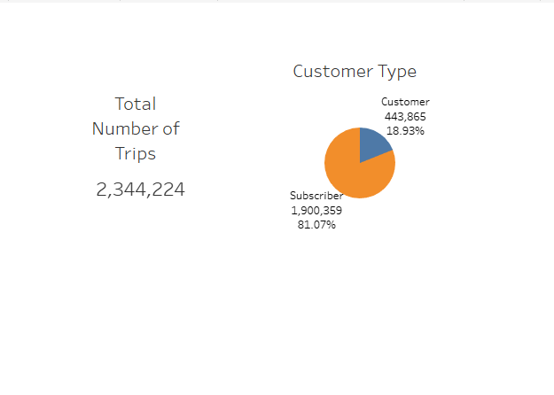
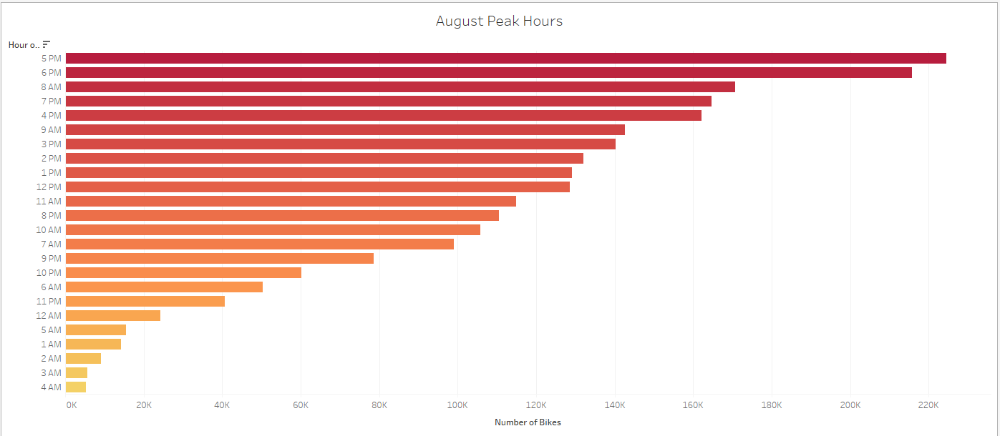
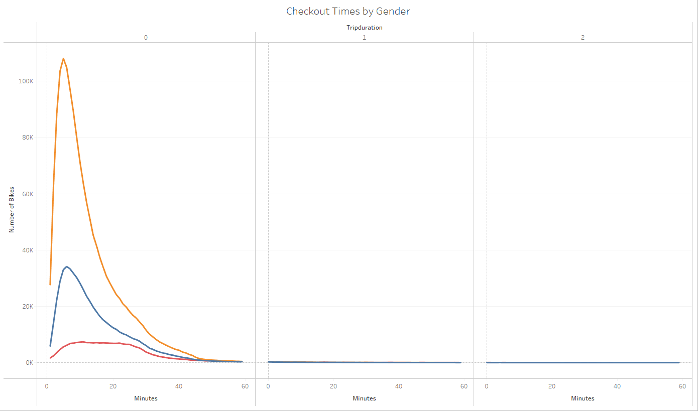
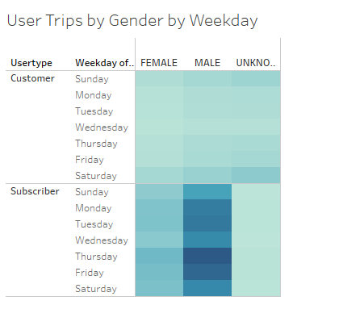
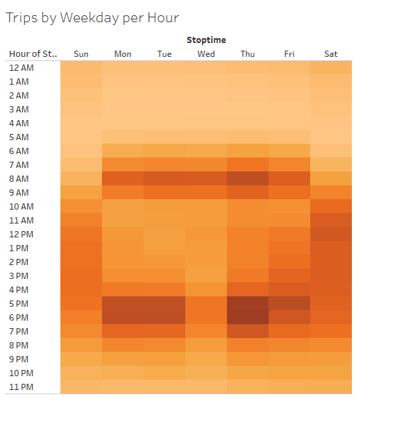
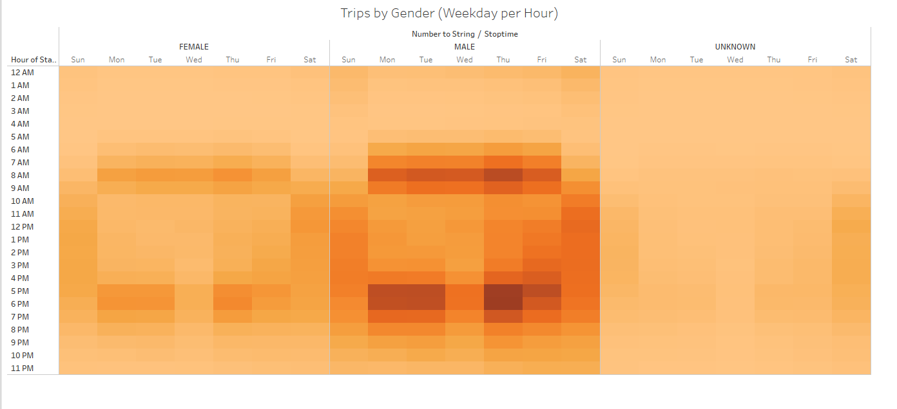

# Bikesharing_Analysis
## Overview
The purpose of this analysis was to examine bike-sharing data in New York to determine whether it was feasible to start a bike-sharing program in Des Moines. We created visuals using Tableau showing the following:
- Peak riding hours in the month of August
- Bike checkout times for overall users as well as genders
- Customer type demographic
- Heatmap showing most active time of day during the week broken down by overall users and genders

## Results

### Customer Breakdown
There were 2,344,224 trips taken during the month of August.
81.07% of trips were taken by subscribers and 18.93% were taken by non-subscribers.

### August Peak Hours
The peak activity hours for August were between 5pm and 6pm.

### Checkout Times by Gender
There are more male riders than female.

### User Trips by Gender by Weekday
Subscribers are most active on Thursdays while non-subscribers are consistently active all days of the week.

### Trips by Weekday per Hour
Thursdays between 5pm and 6pm are the most busy.

### Trips by Gender by Weekday per Hours
The male to female riding ratio is 3:1 on Thursdays between 5pm and 8pm.

## Summary
In this analysis the following were discovered:
- 81.07% of bike riders are subscribers and 18.93% are non-subscribers.
- The month of August recorded 2,344,224 trips.
- The ratio of male to female bike riders is 3:1.
- Thursdays between 5pm and 6pm are the busiest hours for the month of August.

### Additional Analysis
1. I would recommend performing an analysis on the entire year rather than a specific month to provide greater insight as to whether it would be a good idea to start a bike-sharing program in Des Moines.
2. An additional visualization I would create would be counting how many start locations are also the end locations for trips. This would provide insight as to the number of stations needed for the program.